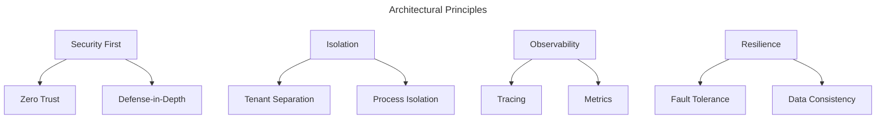
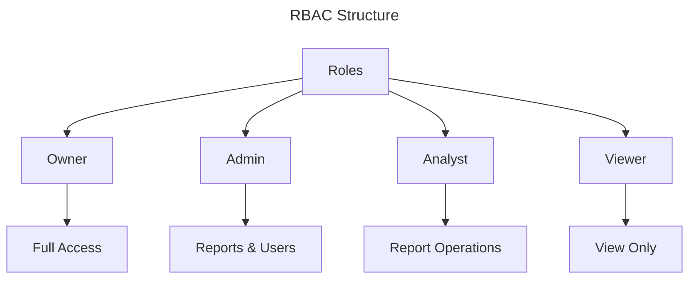

# System Architecture

> 💡 **Overview:** [TODO]

## Core Design Principles

## System Components

### Authentication & Authorization

| Role | Access Level | Capabilities |
|:-----|:------------|:-------------|
| Owner | Full | Complete system access |
| Admin | High | User and report management |
| Analyst | Medium | Report creation/execution |
| Viewer | Low | Report viewing only |
